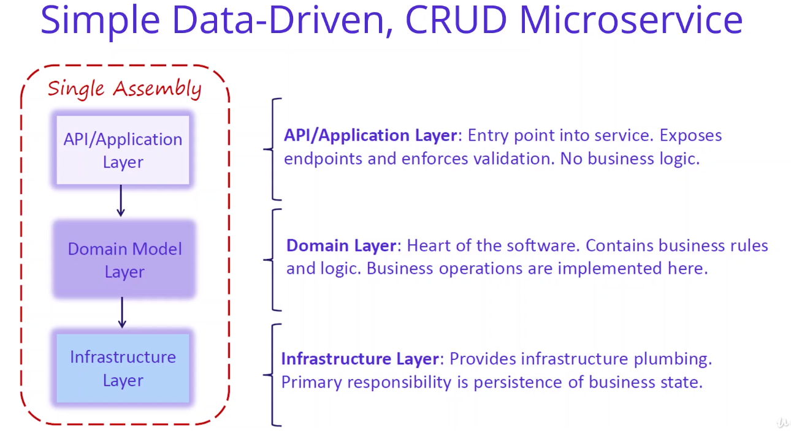

# Anotações do curso

## Developing Your First Microservice - Catalog.API with MongoDb

### Create Asp.Net Web Api Project for Catalog.API Microservice

O instrutor desmarcou a opção **HTTPS** no Visual Studio quando ele estava criando o projeto Catalog.API para que ele pudesse "deploy to Kubernets without certification".

Comando executado com netcore cli:

```bash
dotnet new webapi --auth none --no-https -o Catalog.API
```

### Setup Mongo Docker Database for Catalog.API Microservices

Está usando a imagem oficial do MongoDB do [DockerHub](https://hub.docker.com/) para testes.

Link da imagem oficial no DockerHub: [mongo](https://hub.docker.com/_/mongo).

### MongoDb CLI Commands using Interactive Terminal For MongoDb Connection

Foram executados alguns [comandos de teste](16-Comandos-Testados.md) para demonstrar o mongo.

### Analysis and Architecting of Catalog Microservices

Métodos (REST) da API Catalog:

| Method | Request URI                                    | Use Case                        |
| ------ | ---------------------------------------------- | ------------------------------- |
| GET    | api/v1/Catalog                                 | Listing Products and Categories |
| GET    | api/v1/Catalog/{id}                            | Get Product with product Id     |
| GET    | api/v1/Catalog/GetProductByCategory/{category} | Get Products with category      |
| POST   | api/v1/Catalog                                 | Create new Product              |
| PUT    | api/v1/Catalog                                 | Update Product                  |
| DELETE | api/v1/Catalog/{id}                            | Delete Product                  |

Arquitetura da API Catalog:




Pacotes Nuget que serão utilizados:

- [Swashbuckle.AspNetCore](https://www.nuget.org/packages/Swashbuckle.AspNetCore/)
- [MongoDB.Driver](https://www.nuget.org/packages/mongodb.driver)
