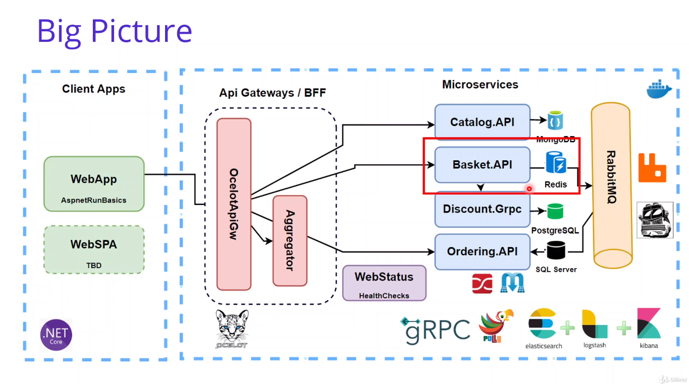
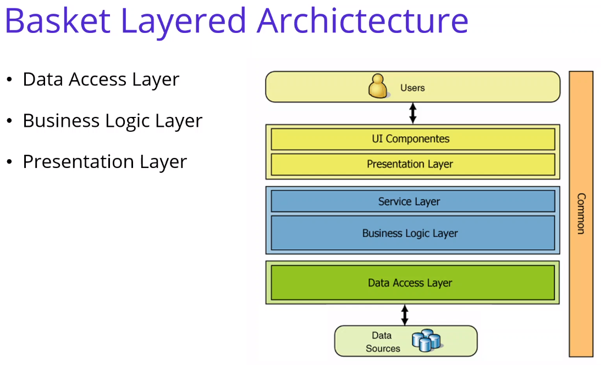
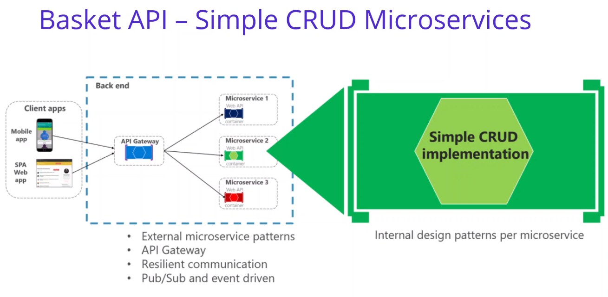
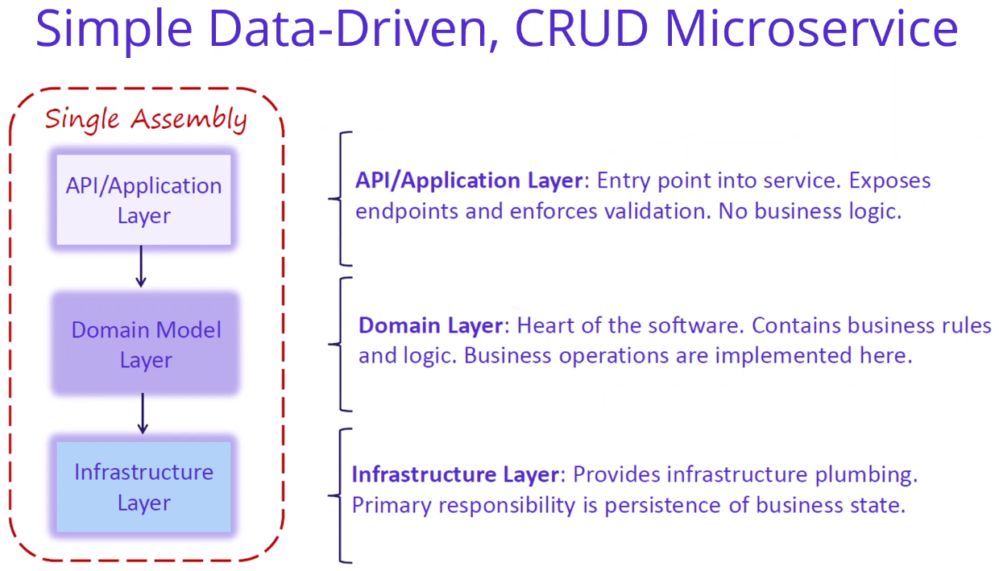

# Anotações do curso

## Developing Basket.API Microservices with Redis

### Introdução

Implementar Basket.API com Redis (Web API com CRUD):



### Create Asp.Net Web Api Project for Catalog.API Microservice

Criado novo projeto `csproj` em `src/Services/Basket` com o comando:

```bash
# Obs.: adicionei o parâmetro --exclude-launch-settings pois aquelas configurações são inúteis no vscode
dotnet new webapi --auth None --no-https --exclude-launch-settings -o Basket.API
```

### Setup Redis Cache Docker Database for Basket.API Microservices

Utiliza a imagem oficial do [Redis no DockerHub](https://hub.docker.com/_/redis) e fez apenas um teste simples de rodar a imagem nessa aula com o comando:

```bash
docker run -d -p 6379:6379 --name aspnetrun-redis redis
```

### Redis CLI Commands using Interactive Terminal For Redis Connection

Executou alguns comandos para demonstrar o redis:

```bash
# Executa no modo interativo o bash do container criado na aula anterior
docker exec -it aspnetrun-redis /bin/bash

# Abre o cli do redis dentro do container
redis-cli

# O redis responde com "PONG"
ping

# "Seta" uma chave chamada key com valor "value"
set key value

# Retorna o valor da chave "key": "value"
get key

# Mesmo teste com chave "name" e value "mehmet"
set name mehmet
get name
```

### Analysis and Architecting of Basket Microservices

#### Métodos (REST) da API Catalog

| Method | Request URI            | Use Case                                              |
|--------|------------------------|-------------------------------------------------------|
| GET    | api/v1/Basket          | Get Basket and Items with username                    |
| POST   | api/v1/Basket          | Update Basket and Items (add - remove item on basket) |
| DELETE | api/v1/Basket/{id}     | Delete Basket                                         |
| POST   | api/v1/Basket/Checkout | Checkout Basket                                       |

#### Arquitetura da API Basket







#### Nuget Packages do Microserviço Basket

- [Microsoft.Extensions.Caching.StackExchangeRedis](https://www.nuget.org/packages/Microsoft.Extensions.Caching.StackExchangeRedis)
- [Newtonsoft.Json](https://www.nuget.org/packages/Newtonsoft.Json/)
- [Swashbuckle.AspNetCore](https://www.nuget.org/packages/Swashbuckle.AspNetCore/)

### Container management with Portainer

Adicionou o [portainer](https://www.portainer.io/) ao docker-compose.

DockerHub: [link](https://hub.docker.com/r/portainer/portainer-ce)
