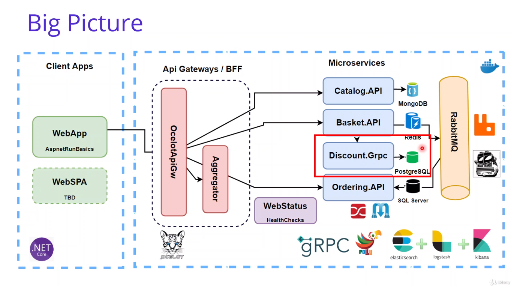
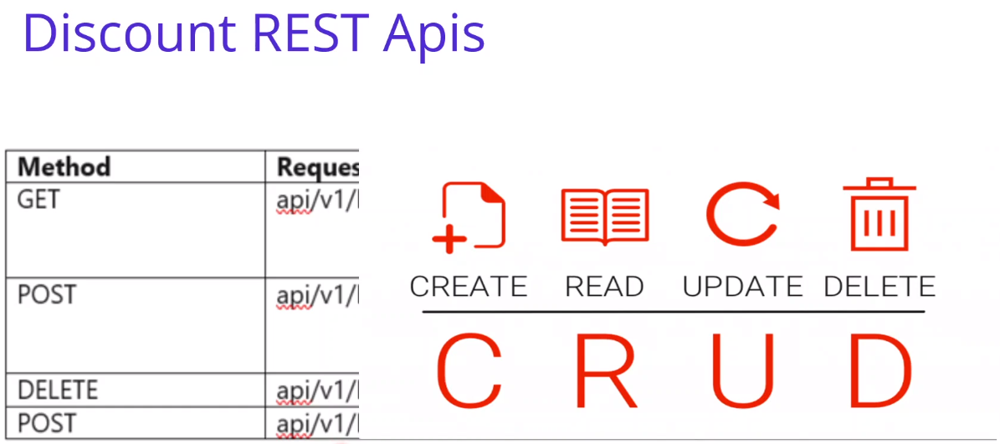
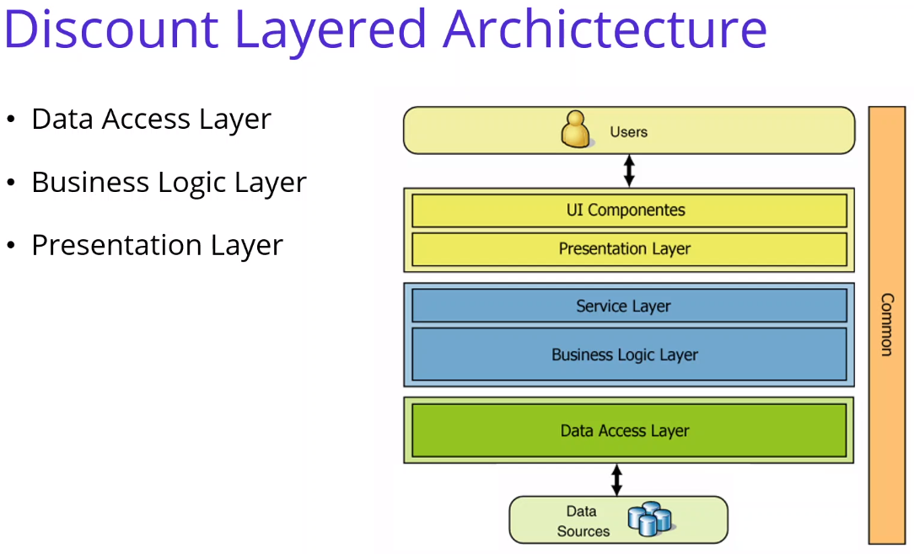
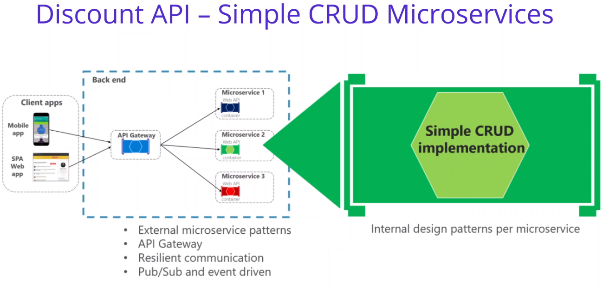
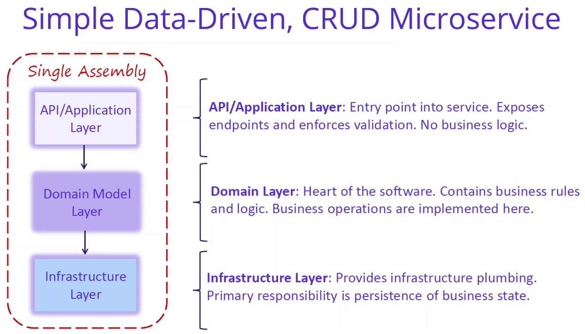

# Anotações do curso

## Developing Discount.API Microservices with PostgreSQL

### Introdução

Implementar Discount.API com PostgreSQL:



### Create Asp.Net Web Api Project for Discount.API Microservice

Criado novo projeto `csproj` em `src/Services/Discount` com o comando:

```bash
# Obs.: adicionei o parâmetro --exclude-launch-settings pois aquelas configurações são inúteis no vscode
dotnet new webapi --auth None --no-https --exclude-launch-settings -o Discount.API
```

### Setup PostgreSQL Docker Database for Discount.API Microservices

Adicionada a imagem oficial do [PostgreSQL](https://hub.docker.com/_/postgres) no [docker-compose.yaml](AspnetMicroservices/src/docker-compose.yaml).

### Setup pgAdmin Management Portal for PostgreSQL Database for Discount.API Microse

Adicionada a imagem [dpage/pgadmin4](https://hub.docker.com/r/dpage/pgadmin4/) para acesso ao banco de dados no [docker-compose.yaml](AspnetMicroservices/src/docker-compose.yaml).

### Create Coupon Table in the DiscountDb of PostgreSQL Database with pgAdmin Manage

Criou as tabelas com comandos sql, utilizando o pgAdmin (localhost:5050 -> Tools -> Query Tools)

```sql
# Criar tabela "Coupon"
CREATE TABLE Coupon(
    ID SERIAL PRIMARY KEY       NOT NULL,
    ProductName     VARCHAR(24) NOT NULL,
    Description     TEXT,
    Amount          INT
);
```

Verificou que a tabela foi criada pelo menu esquerdo (Serveres -> DiscountServer -> Databases -> DicountDb -> Schemas -> public -> Tables (clica com o botão direito e refresh)).

Executou comandos de "INSERT" através do Query Tools:

```sql
INSERT INTO Coupon (ProductName, Description, Amount) VALUES ('IPhone X', 'IPhone Discount', 150);

INSERT INTO Coupon (ProductName, Description, Amount) VALUES ('Samsung 10', 'Samsung Discount', 100);
```

E Por fim visualizar os items inseridos com:

```sql
SELECT * FROM public.coupon
    ORDER BY id ASC 
```

### Analysis and Architecting of Discount Microservices

#### Métodos (REST) da API Discount



#### Arquitetura da API Discount







#### Nuget Packages do Microserviço Discount

- [Npgsql](https://www.nuget.org/packages/Npgsql/)
- [Dapper](https://www.nuget.org/packages/Dapper/)
- [Swashbuckle.AspNetCore](https://www.nuget.org/packages/Swashbuckle.AspNetCore/)
