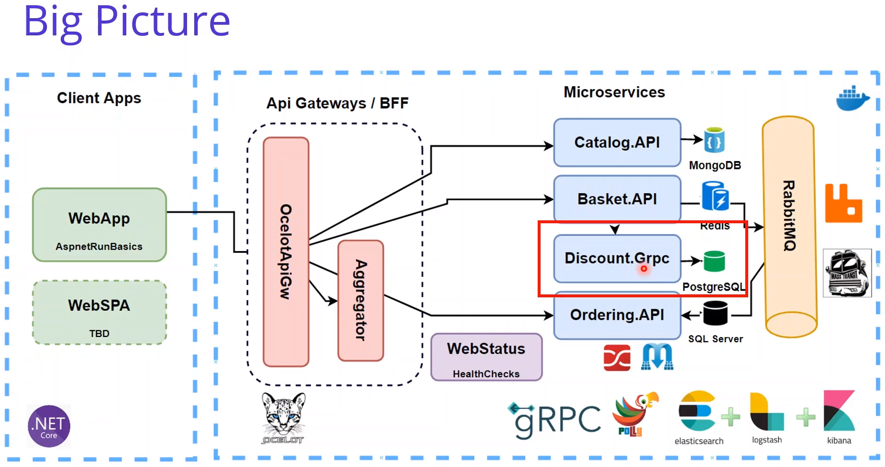
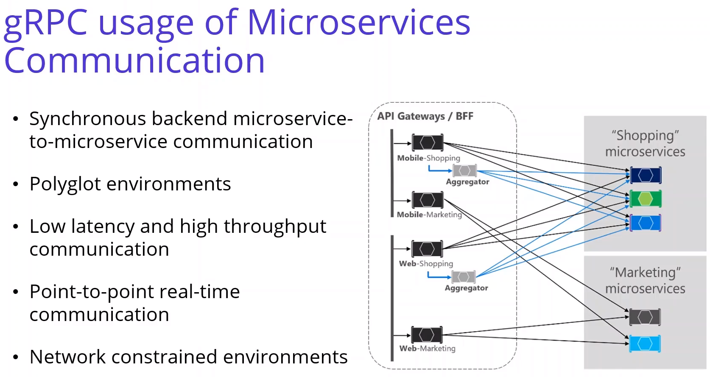
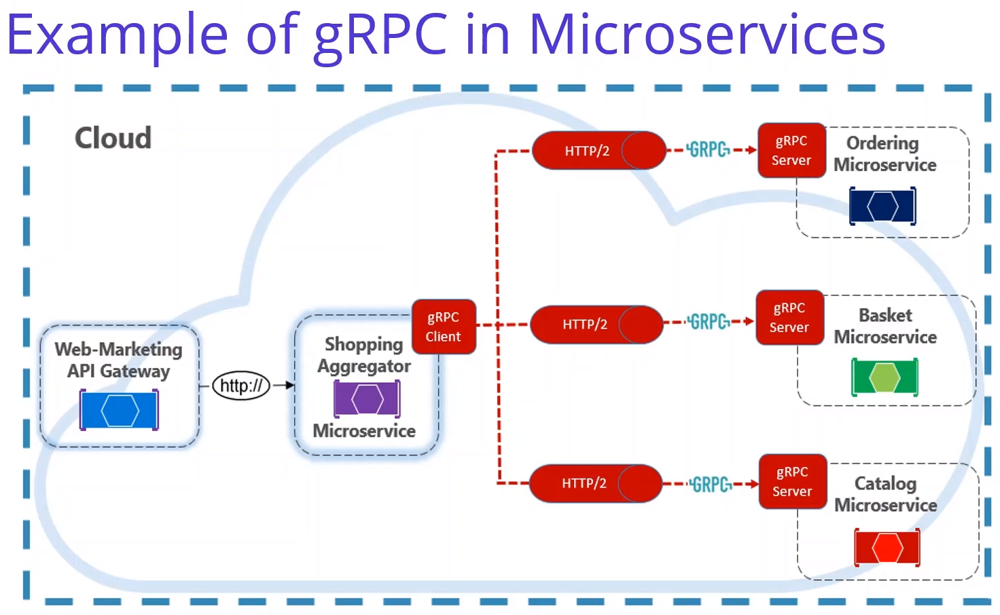

# Anotações do curso

## Developing Discount.Grpc Microservices for Microservices Grpc Communication

### Introdução

Implementar Discount.Grpc (Grpc Communication):



### gRPC usage of Microservices Communication





### Create Discount Grpc Microservices Project in Microservices Solution

Criado projeto Discount.Grpc com o comando:

```bash
dotnet new grpc -o Discount.Grpc --exclude-launch-settings
```

### Developing DiscountService class to Implement Grpc Proto Service Methods

Os métodos Grpc são expostos como numa api, mas ao invés de utilizar um controller, serviços são expostos com `endpoints.MapGrpcService<CLASSE_DO_SERVICO>();`.

### Implementing AutoMapper into DiscountService Class of Discount Grpc Microservice

Adicionou e configurou o pacote nuget [AutoMapper](https://www.nuget.org/packages/AutoMapper/).
