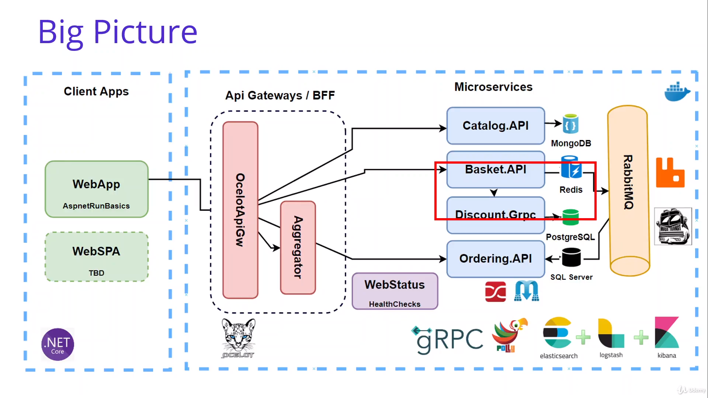

# Anotações do curso

## Consuming Discount Grpc Service From Basket Microservice When Adding Cart Item

### Introdução

Consumir serviços de Discount.Grpc através do microserviço "Basket":



### Consuming Discount Grpc Service From Basket Microservice When Adding Cart Item 1

O instrutor usou o Visual Studio para adicionar uma referência de serviço gRPC (Add service reference -> gRPC).  
Como estou no vscode eu fiz o mesmo pelo cli com ajuda da "tool" dotnet-grpc.

Na raiz do projeto (06-Consuming-Discount-Grpc-Service-From-Basket-Microservice-When-Adding-Cart-Item/AspnetMicroservices) eu executei os seguintes comandos para criar um [tool-manifest](AspnetMicroservices/.config/dotnet-tools.json) e instalar a ferramenta dotnet-grpc.

```bash
# Cria a pasta .config onde o comando foi executado
dotnet new tool-manifest

# Adiciona uma referência ao gotnet-grpc no "tool-manifest" criado
dotnet tool install dotnet-grpc
```

Depois para executar a ferramente a adicionar a referência gRPC, eu executei os seguintes comandos na pasta Basket.API:

```bash
# Adiciona o arquivo proto como referência e informa que o tipo da classe gerada vai ser "Client"
dotnet tool run dotnet-grpc add-file ../../Discount/Discount.Grpc/Protos/discount.proto --services Client
```

Obs.: se eu tivesse instalado a tool globalmente (`dotnet tool install -g dotnet-grpc`) não seria necessário criar o tool manifest e não precisaria colocar `dotnet tool run`para executar o comando (o comando com global ficaria `dotnet grpc add-file ../../Discount/Discount.Grpc/Protos/discount.proto --services Client`), porém eu preferi optar por adicionar um tool-manifest para ficar registrado todas as ferramentas que eu utilizei e em qual versão eu as utilizei no curso caso eu precise de uma referência (sem falar que eu evito de ficar instalando globalmente "coisas" que eu só vou utilizar uma vez).

Obs.2: utilizando essa ferramenta, mais pacotes foram adicionados ao ".csproj" do que pelo Visual Studio, provavelmente esses outros pacotes são desnecessários, mas por via das dúvidas vou deixar lá por enquanto.
