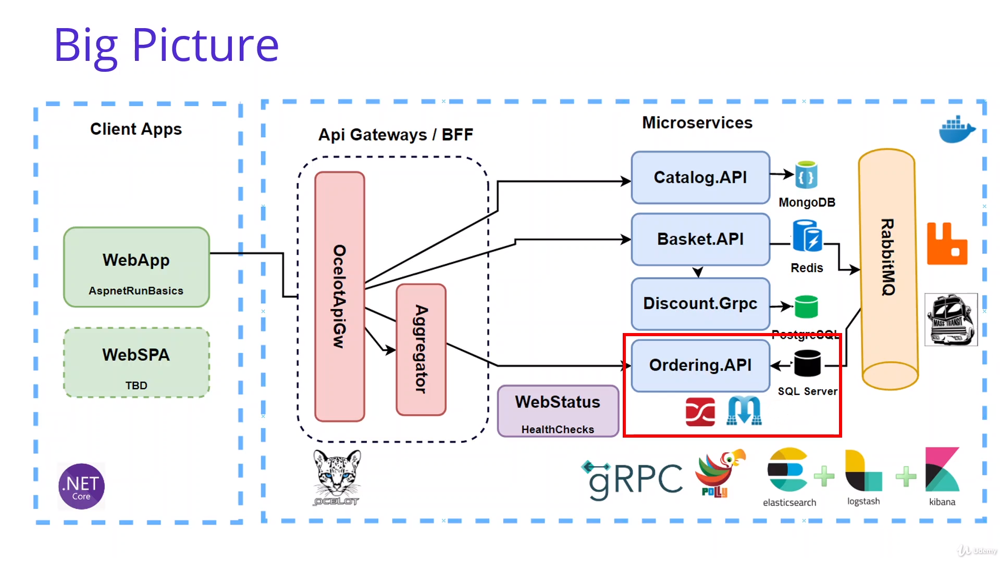
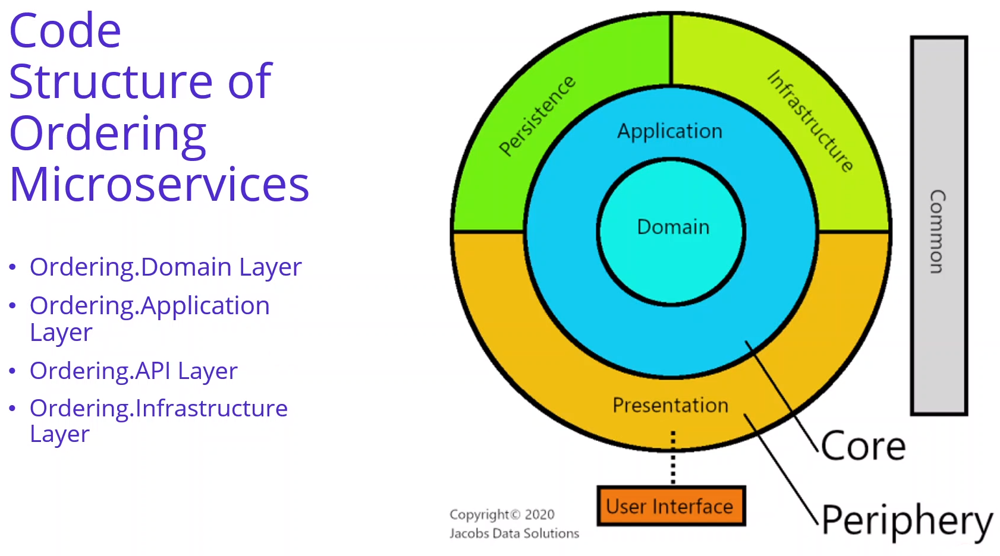
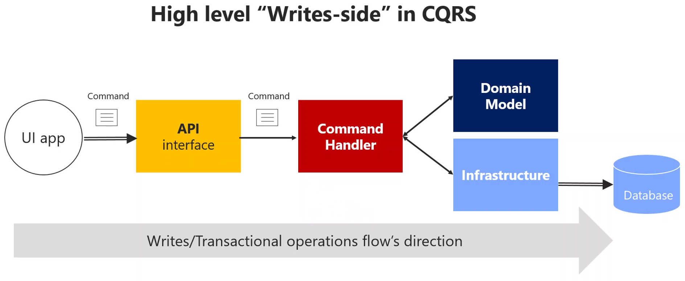

# Anotações do curso

## Developing Ordering Microservices with Clean Architecture and CQRS Implemntation

### Introdução

Implementar Ordering.API com Clean Architecture e CQRS:



### Analysis and Architecting of Ordering Microservices

#### Ordering REST APIs

| Method | Request URI  | Use Case                 |
|--------|--------------|--------------------------|
| GET    | api/v1/Order | Get Orders with username |

- Get Orders with username
- Consume basketCheckout event from RabbitMQ
- CQRS implementation with triggering OrderCommand to insert Order record


### Design Principles - SOLID


### Design Principles - Dependency Inversion Principles (DIP)


### Design Principles - Separation of Concerns (SoC)


### Domain Driven Design - DDD


### Clean Architecture with Domain Driven Design (DDD)

[](https://medium.com/software-alchemy/a-brief-intro-to-clean-architecture-clean-ddd-and-cqrs-23243c3f31b3)


### CQRS (Command Query Responsibility Segregation) Design Pattern


### Eventual Consistency and Event Sourcing with CQRS Design Pattern


### Code Structure on CQRS and DDD Implementation in Ordering Microservices




#### Ordering.Domain Nuget Packages

- Nenhum pacote nuget

#### Ordering.Application Nuget Packages

- [MediatR.Extensions.Microsoft.DependencyInjection](https://www.nuget.org/packages/MediatR.Extensions.Microsoft.DependencyInjection/)
- [FluentValidation](https://www.nuget.org/packages/fluentvalidation)
- [FluentValidation.DependencyInjectionExtensions](https://www.nuget.org/packages/fluentvalidation.dependencyinjectionextensions/)
- [AutoMapper](https://www.nuget.org/packages/AutoMapper/)
- [AutoMapper.Extensions.Microsoft.DependencyInjection](https://www.nuget.org/packages/AutoMapper.Extensions.Microsoft.DependencyInjection/)
- [Microsoft.Extensions.Logging.Abstractions](https://www.nuget.org/packages/Microsoft.Extensions.Logging.Abstractions/)
- ProjectReference - Ordering.Domain

#### Ordering.Infrastructure Nuget Packages

- [Microsoft.EntityFrameworkCore.SqlServer](https://www.nuget.org/packages/Microsoft.EntityFrameworkCore.SqlServer/)
- [SendGrid](https://www.nuget.org/packages/sendgrid/)
- ProjectReference - Ordering.Application

#### Ordering.API Nuget Packages

- [Microsoft.EntityFrameworkCore.Tools](https://www.nuget.org/packages/Microsoft.EntityFrameworkCore.Tools)
- ProjectReference - Ordering.Application
- ProjectReference - Ordering.Infrastructure

#### Menções

Menções do instrutor, duas pessoas que possuem ótimos repositórios/materiais para referência.


| [Jason Taylor](https://github.com/jasontaylordev)                                                                  | [Gill Cleeren](https://github.com/GillCleeren)                                                      |
|--------------------------------------------------------------------------------------------------------------------|-----------------------------------------------------------------------------------------------------|
| [Repositório GitHub: CleanArchitecture](https://github.com/jasontaylordev/CleanArchitecture)                       | [Twitter](https://twitter.com/gillcleeren/)                                                         |
| [YouTube: Clean Architecture with ASP.NET Core 3.0 - Jason Taylor - NDC Sydney 2019](https://youtu.be/5OtUm1BLmG0) | [YouTube: Gill CLEEREN: Clean architecture with ASP.NET Core UCP2019](https://youtu.be/BxtHt7tsX-c) |

### Create Asp.Net Web Api Project for Ordering.API Microservice

Adicionado novo projeto "Ordering.API" em "src/Services/Ordering" com o comando:

```bash
dotnet new webapi --exclude-launch-settings --no-https --auth None -o Ordering.API
```

Configurado ".vscode/launch.json" para utilizar a porta 5004

### Create Clean Architecture Layers that Ordering Domain - Application and Infra

Adicionado novos projetos "Ordering.Domain", "Ordering.Application" e "Ordering.Infrastructure" em "src/Services/Ordering" com os comandos:

```bash
dotnet new classlib -o Ordering.Domain
dotnet new classlib -o Ordering.Application
dotnet new classlib -o Ordering.Infrastructure
```

Obs.: Devido a estar utilizando vscode com net core cli, precisei adicionar os novos projetos todas a solution com os comandos executados na pasta "src":

```bash
dotnet sln add ./Services/Ordering/Ordering.API
dotnet sln add ./Services/Ordering/Ordering.Domain
dotnet sln add ./Services/Ordering/Ordering.Application
dotnet sln add ./Services/Ordering/Ordering.Infrastructure
```

### Adding Project References Between Clean Architecture Layers

Adicionadas as referências entre projetos com dotnet cli, executando os seguintes comandos na pasta "src/Services/Ordering":

```bash
# Adiciona uma referência do projeto "Domain" no projeto "Application"
dotnet add ./Ordering.Application/Ordering.Application.csproj reference ./Ordering.Domain/Ordering.Domain.csproj

# Adiciona uma referência do projeto "Application" no projeto "Infrastructure"
dotnet add ./Ordering.Infrastructure/Ordering.Infrastructure.csproj reference ./Ordering.Application/Ordering.Application.csproj

# Adiciona uma referência do projeto "Application" no projeto "API"
dotnet add ./Ordering.API/Ordering.API.csproj reference ./Ordering.Application/Ordering.Application.csproj

# Adiciona uma referência do projeto "Infrastructure" no projeto "API"
dotnet add ./Ordering.API/Ordering.API.csproj reference ./Ordering.Infrastructure/Ordering.Infrastructure.csproj
```

### CQRS Implementation with Mediator Design Pattern




### Developing Ordering.Infrastructure Layer in Clean Architecture - Persistence

Adicionados os pacotes nuget [SendGrid](https://www.nuget.org/packages/sendgrid/) e [Microsoft.EntityFrameworkCore.SqlServer](https://www.nuget.org/packages/Microsoft.EntityFrameworkCore.SqlServer/) em Ordering.Infrastructure:

```bash
dotnet add package SendGrid
dotnet add package Microsoft.EntityFrameworkCore.SqlServer
```

### Adding EF Core Migrations for Code-First Approach in Ordering Microservices

Adicionados o pacote nuget [Microsoft.EntityFrameworkCore.Tools](https://www.nuget.org/packages/Microsoft.EntityFrameworkCore.Tools) em Ordering.API:

```bash
dotnet add package Microsoft.EntityFrameworkCore.Tools
```

O instrutor usou o comando  `Add-Migration InitialCreate` em Ordering.Infrastructure, porém como estou utilizando preciso adicionar a tool dotnet-ef (de preferência global, mas vou adicionar no projeto para ficar registrado em `.config`) e para isso vou executar na pasta `AspnetMicroservices` o comando:

```bash
dotnet tool install dotnet-ef
```

E agora para criar a migration vou executar em `AspnetMicroservices/src/Services/Ordering/Ordering.Infrastructure`:

```bash
dotnet tool run dotnet-ef migrations add InitialCreate --startup-project '../Ordering.API/Ordering.API.csproj'

# Obs.: se a tool estivesse instalada globalmente eu poderia executar o seguinte comando (um pouco menor)
# dotnet ef migrations add InitialCreate --startup-project '../Ordering.API/Ordering.API.csproj'
```
