# Anotações do curso

## Microservices Async Communication w/ RabbitMQ & MassTransit for Checkout Order

### Introdução

Implementar comunição assíncrona com RabbitMQ e MassTransit para "Checkout Order" entre os microserviços Basket e Ordering.

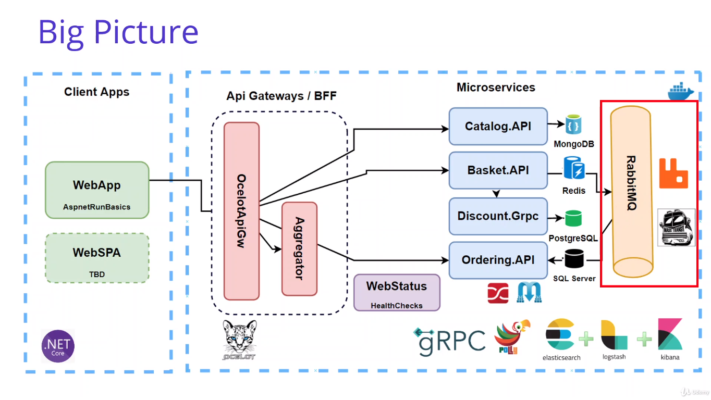

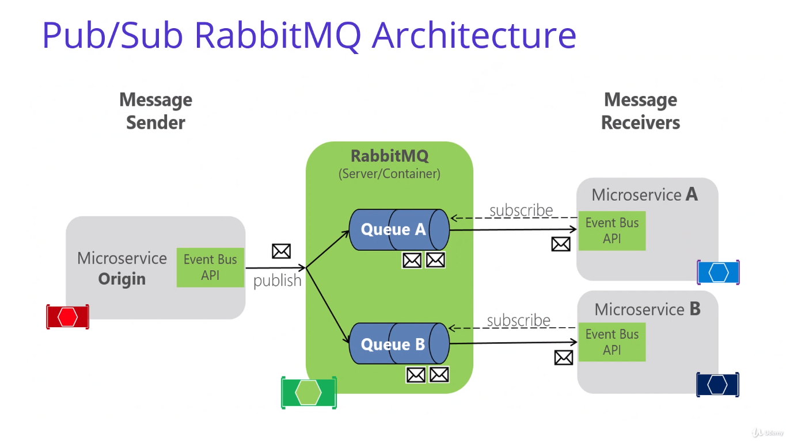

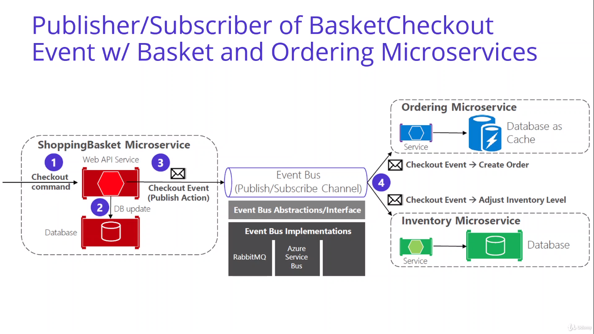

### Microservices Communication Types Request-Driven or Event-Driven Architecture

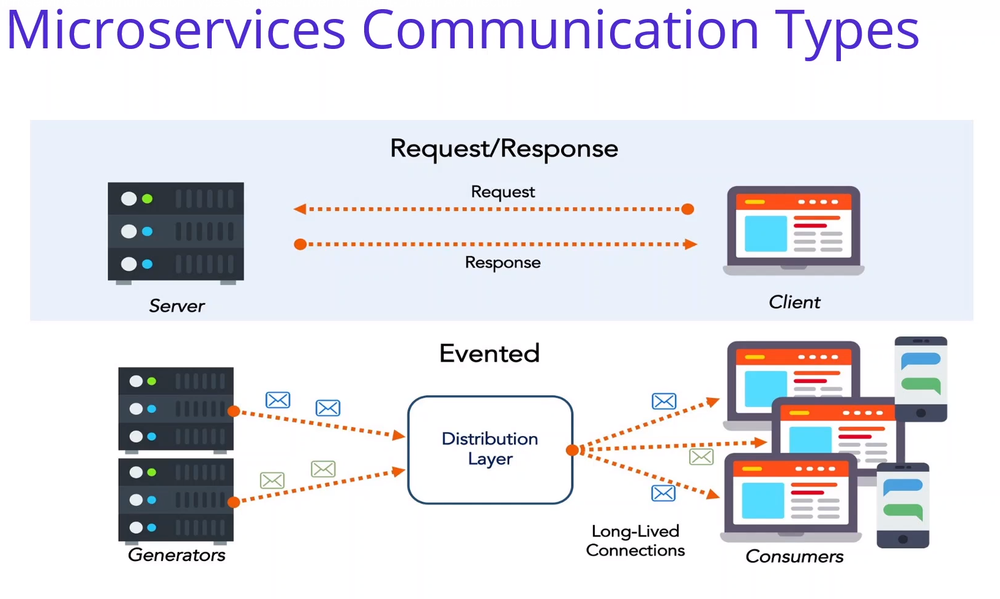

### What is RabbitMQ, Main Components of RabbitMQ

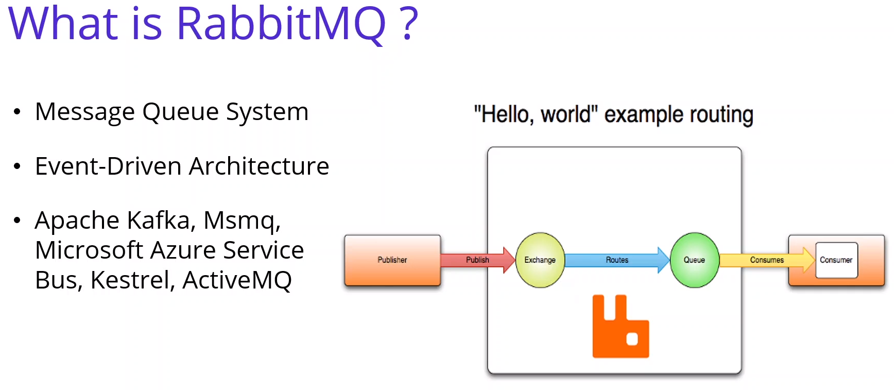

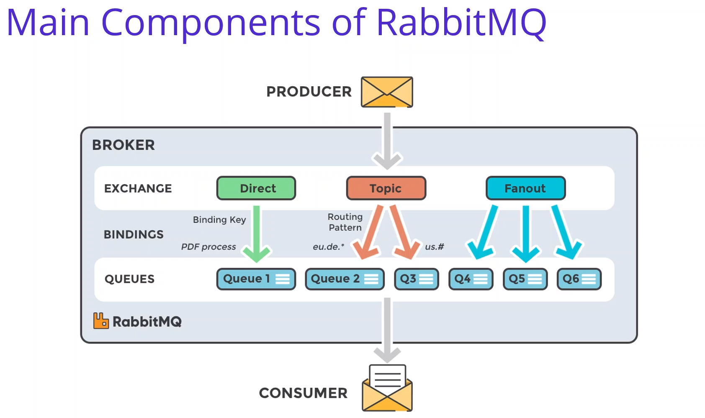

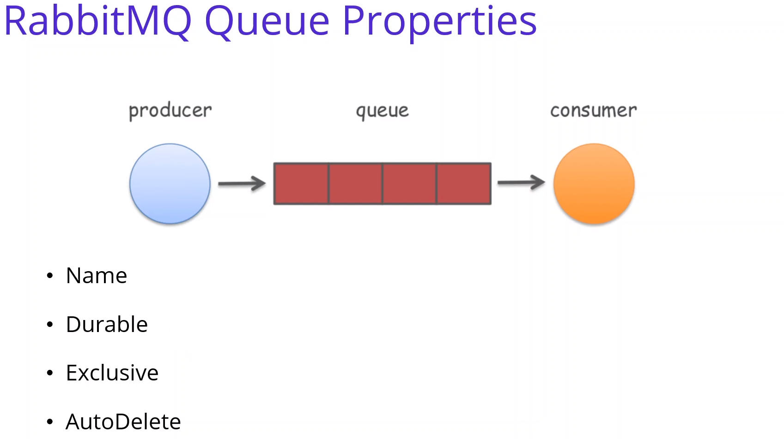

### RabbitMQ Exchange Types

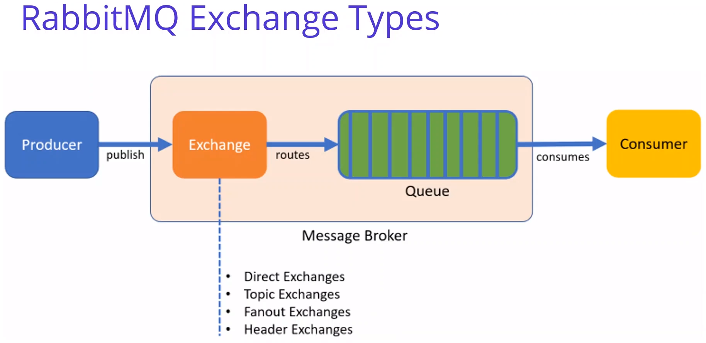

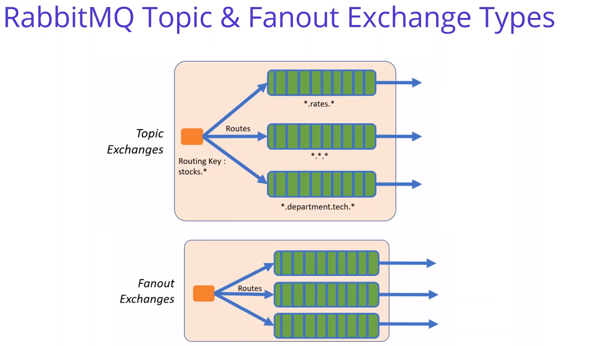

### Adding RabbitMQ image into Docker-Compose File for Multi-Container Docker Env

Adiciona a imagem oficial do [RabbitMQ](https://hub.docker.com/_/rabbitmq) no docker-compose.

### Analysis & Design BuildingBlocks EventBus.Messages Class Library Project

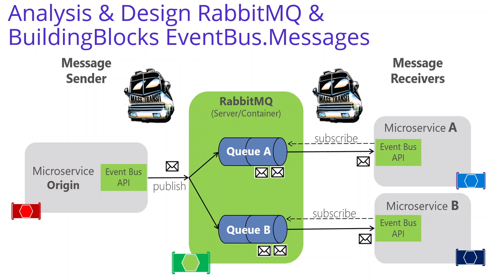

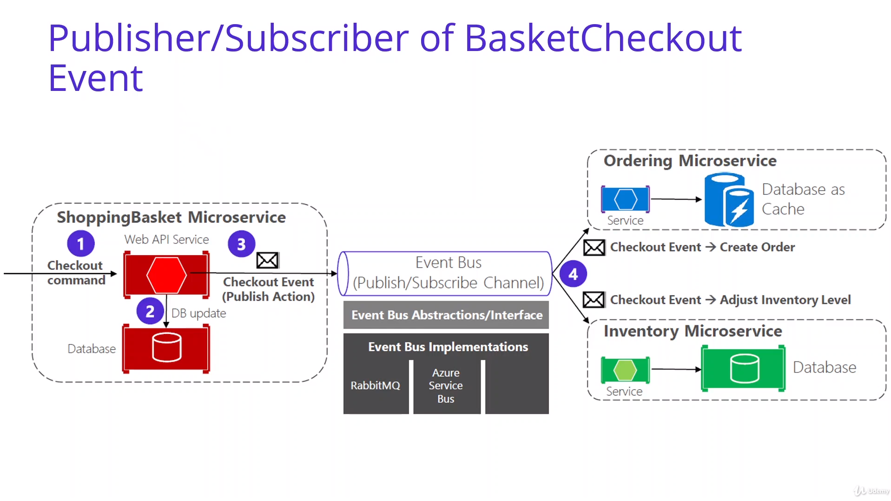

#### RabbitMQ Nuget Packages

- [MassTransit](https://www.nuget.org/packages/MassTransit/)
- [MassTransit.RabbitMQ](https://www.nuget.org/packages/MassTransit.RabbitMQ/)
- [MassTransit.AspNetCore](https://www.nuget.org/packages/MassTransit.AspNetCore/)
- REST API principles, CRUD operations
- Add Project Reference - EventBus.Messages

### Developing BuildingBlocks EventBus.Messages Class Library

Adicionado novo projeto "EventBus.Messages" em "src/BuildingBlocks" com os comandos:

```bash
# Criando um projeto classlib em src/BuildingBlocks/EventBus.Messages
dotnet new classlib -o EventBus.Messages

# Voltando para a pasta que contém a solution "aspnetrun-microservices.sln" (pasta 'src')
cd ..

# Adicionado o projeto csproj no arquivo de solution
dotnet sln add ./BuildingBlocks/EventBus.Messages/EventBus.Messages.csproj
```

### Produce RabbitMQ Event From Basket Microservice Publisher of BasketCheckoutEvent

Adicionada referência do projeto EventBus.Messages no projeto Basket.API executando o seguinte comando dentro de src/Services/Basket/Basket.API¨

```bash
dotnet add reference ../../../BuildingBlocks/EventBus.Messages/EventBus.Messages.csproj
```

E depois adicionados os pacotes necessários para o EventBus em Basket.API:

```bash
dotnet add package MassTransit
dotnet add package MassTransit.RabbitMQ
dotnet add package MassTransit.AspNetCore
```
