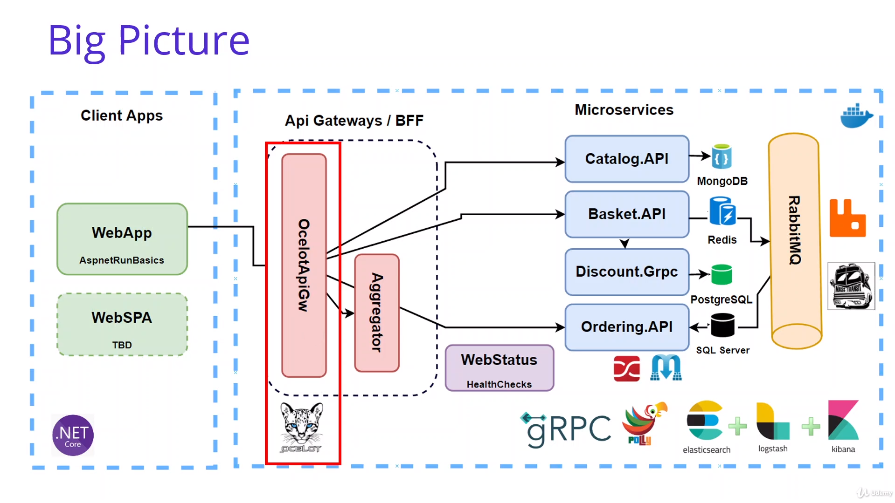
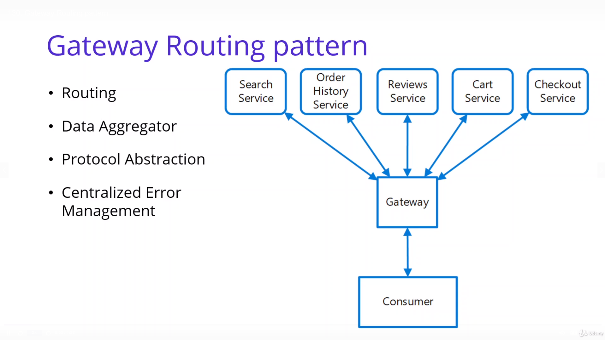
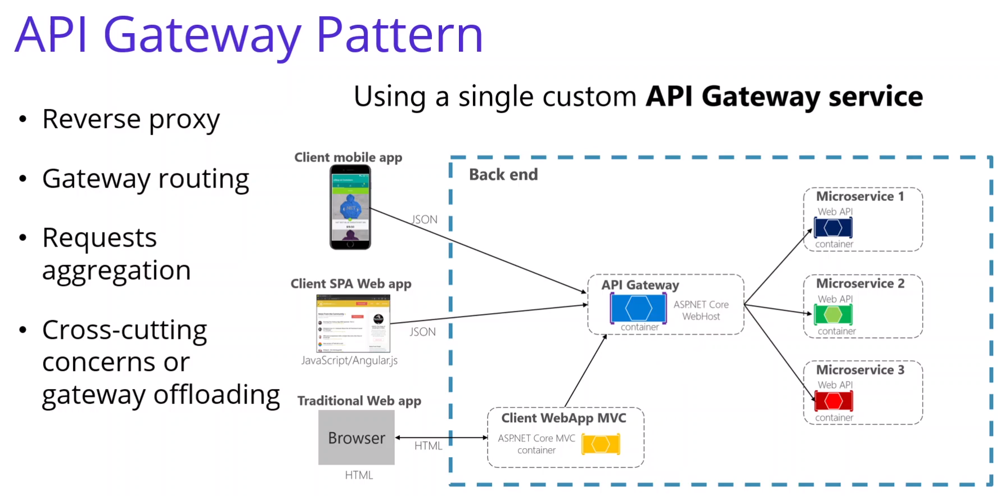
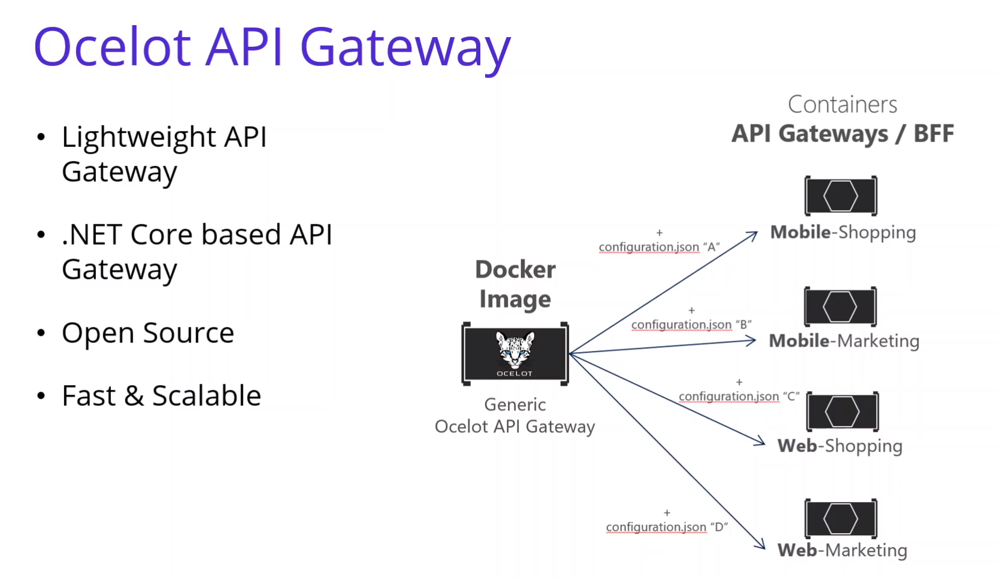
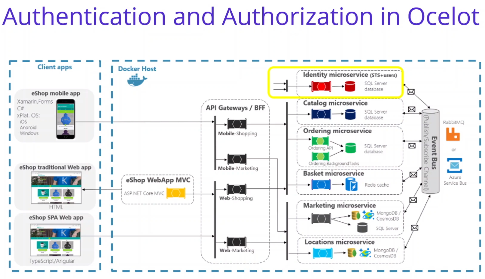
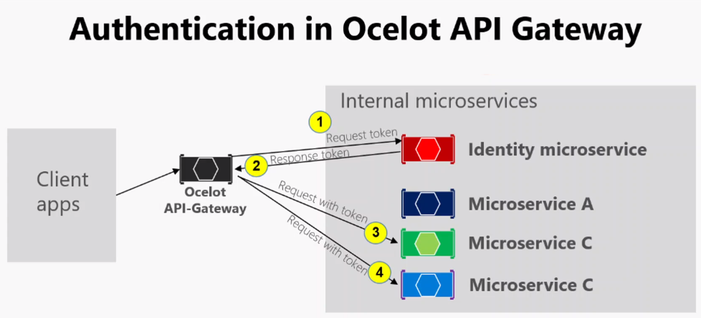
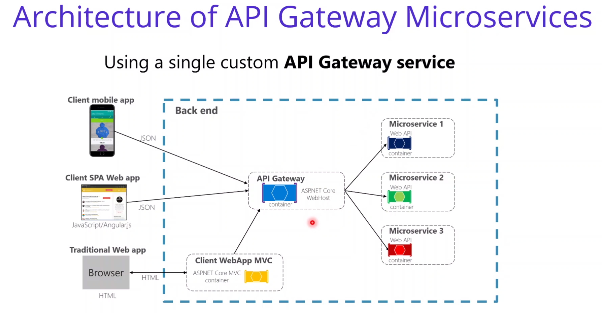

# Anotações do curso

## Microservices Async Communication w/ RabbitMQ & MassTransit for Checkout Order

### Introdução

Implementar Api Gateways com Ocelot aplicando Gateway Routing Pattern.

### Gateway Routing pattern

### API Gateway Pattern

  

### BFF Backend for Frontend Pattern

### Main features in the API Gateway pattern

#### Ocelot Features

|                                        |                                     |
|----------------------------------------|-------------------------------------|
| Routing                                | Authentication                      |
| Request Aggregation                    | Authorization                       |
| Service Discovery with Consul & Eureka | Throttling                          |
| Load Balancing                         | Logging, Tracing                    |
| Correlation Pass-Through               | Headers/Query String Transformation |
| Quality of Service                     | Custom Middleware                   |

### Ocelot API Gateway

### Authentication and authorization in Ocelot API Gateway

### Analysis & Desing of API Gateway

- Route Catalog APIs with /Catalog path
- Route Baket APIs wiht /Basket path
- Route Ordering APIs with /Ordering path

| Method   | Request URI      | Use Case                     |
|----------|------------------|------------------------------|
| GET/POST | /Catalog         | Route   /api/v1/Catalog apis |
| GET      | /Catalog/{id}    | Route   /api/v1/Catalog apis |
| GET/POST | /Basket          | Basket  /api/v1/Basket apis  |
| POST     | /Basket/Checkout | Basket  /api/v1/Basket apis  |
| GET      | /Order           | Order   /api/v1/Order apis   |

#### Nuget Packages of API Gateway

- [Ocelot](https://www.nuget.org/packages/Ocelot/)
- [Microsoft.VisualStudio.Azure.Containers.Tools.Targets](https://www.nuget.org/packages/Microsoft.VisualStudio.Azure.Containers.Tools.Targets)
