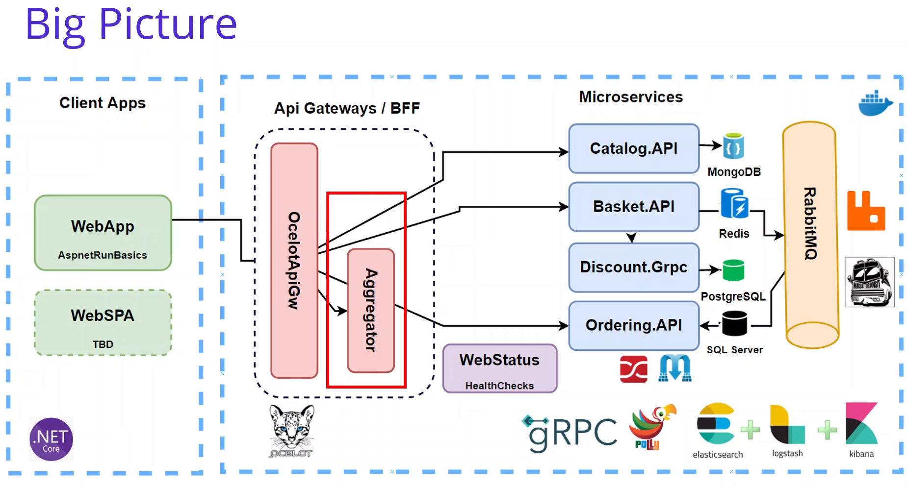
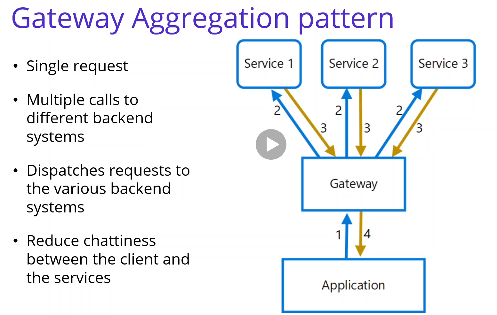
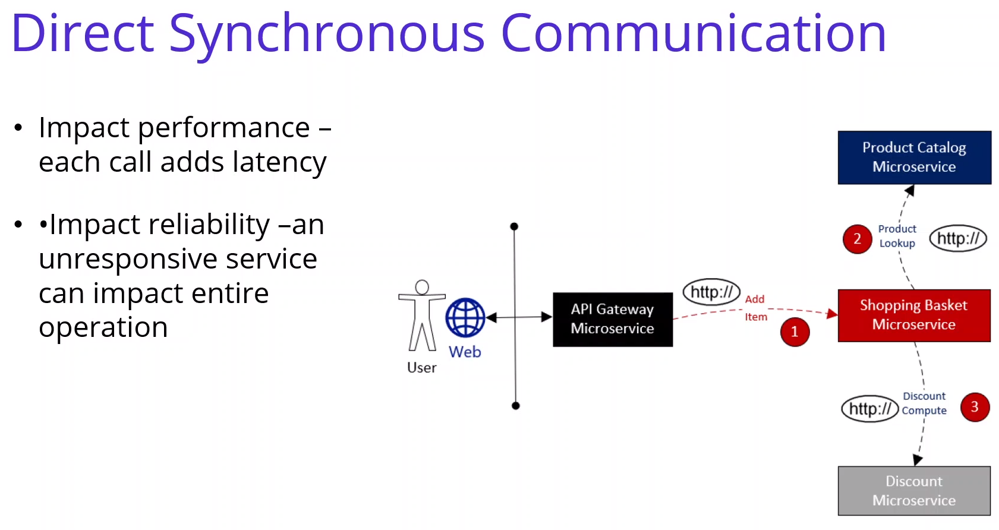
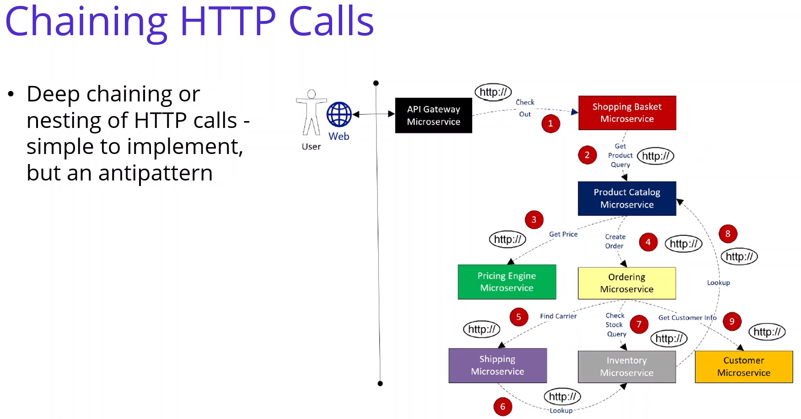
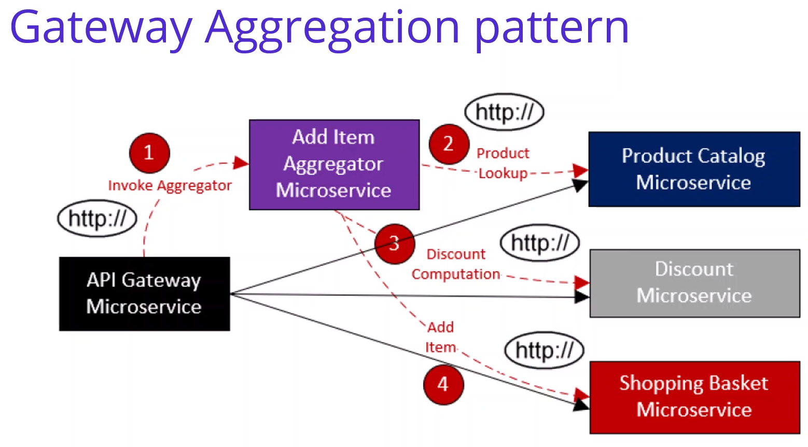
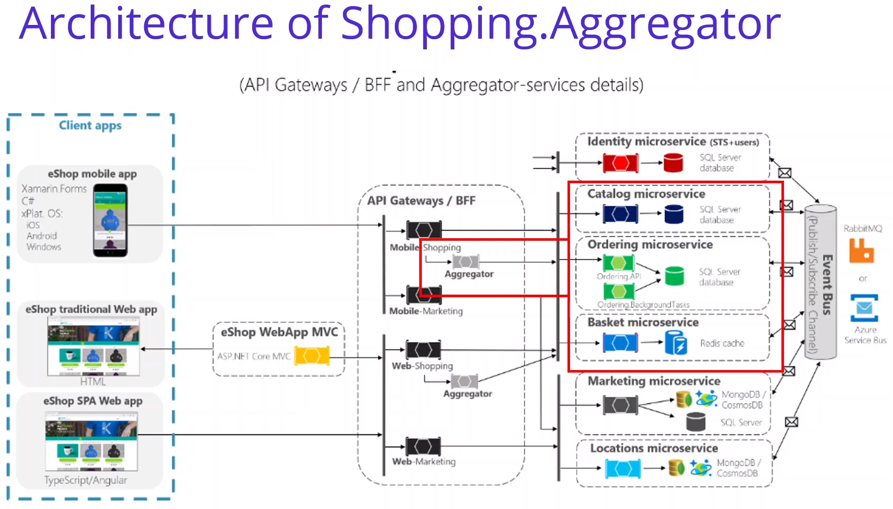

# Anotações do curso

## Api Gateway - Requests Aggregation Pattern in Shopping.Aggregator

### Introdução

Utilizar o Aggragation Pattern para facilitar a comunicação com as apis (um request para aggregation vão ser vários requests para as apis).

### Gateway Aggregation pattern

### Analysis & Design of Shopping.Aggragator Microservices - Gateway Aggregation

