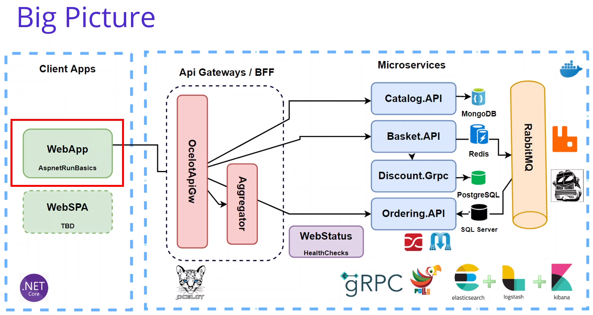
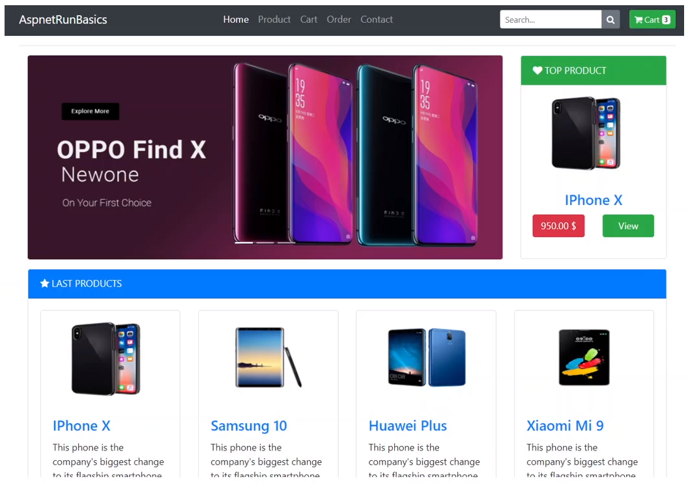
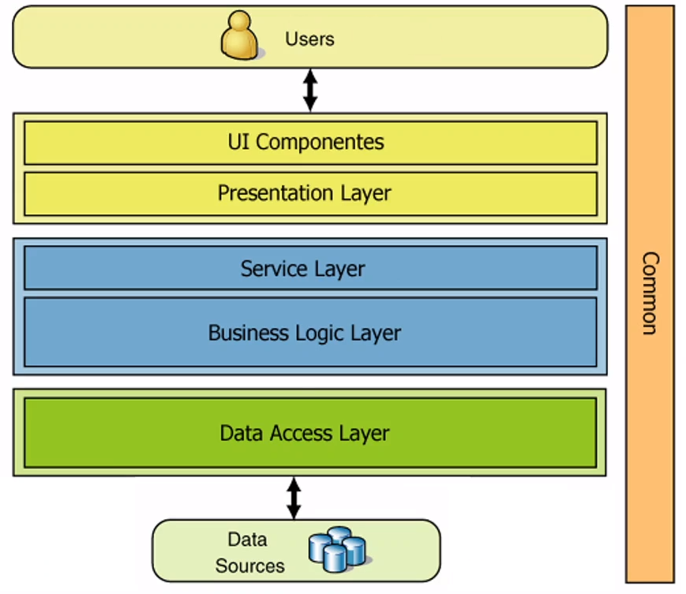

# Anotações do curso

## Building Shopping Web Application Microservices

## Background of Project

### Shopping Web Application Microservices

- Default Web Application
- Razor Templates
- HttpClientFactory
- Consume Ocelot API Gateway

### Base Repository of Shopping App

- Base Application
- Github Repository of aspnetcore-basics
- Razor Pages
- Bootstrap4

Link do repostitório base: [run-aspnetcore-basics](https://github.com/aspnetrun/run-aspnetcore-basics)

## Analysis & Design Shopping Web Application Microservice

- Listing Products and Categories
- Add Product to Shopping Cart
- Checkout Order

### Shopping Microservices Architecture

- Data Access Layer
- Business Logic Layer
- Presentation Layer

### Nuget Packages of Shopping Microservices

- [Microsoft.AspNet.WebApi.Client](https://www.nuget.org/packages/Microsoft.AspNet.WebApi.Client/)
- HTTPClientFactory
