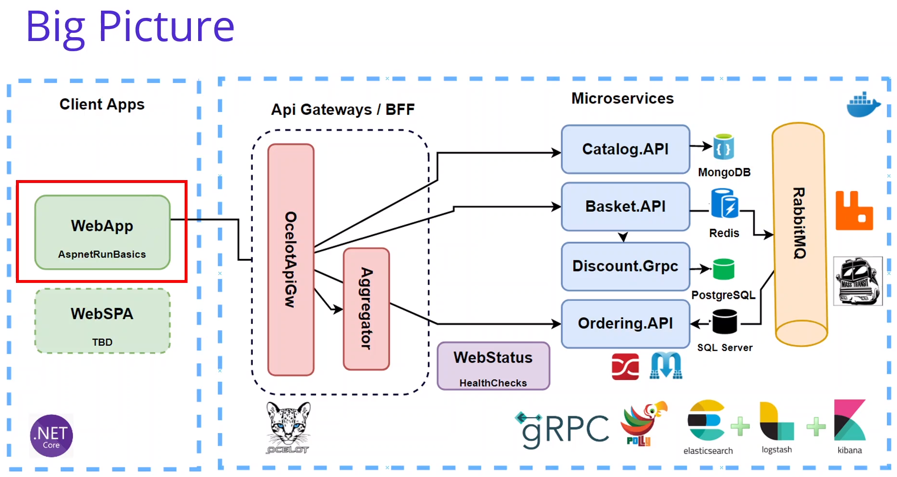
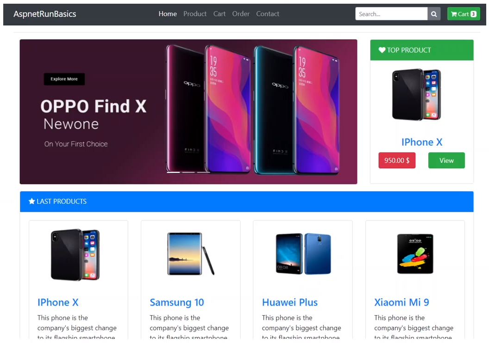
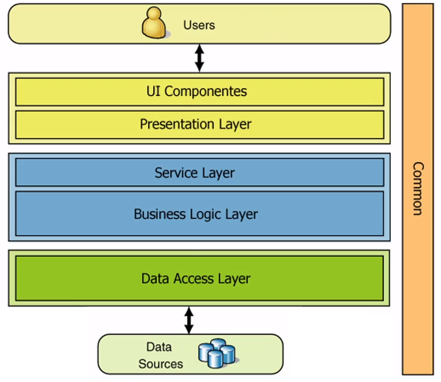

# Anotações do curso

## Building Shopping Web Application Microservices



## Background of Project

### Shopping Web Application Microservices

- Default Web Application
- Razor Templates
- HttpClientFactory
- Consume Ocelot API Gateway



### Base Repository of Shopping App

- Base Application
- Github Repository of aspnetcore-basics
- Razor Pages
- Bootstrap4

Link do repostitório base: [run-aspnetcore-basics](https://github.com/aspnetrun/run-aspnetcore-basics)

## Analysis & Design Shopping Web Application Microservice

- Listing Products and Categories
- Add Product to Shopping Cart
- Checkout Order

### Shopping Microservices Architecture

- Data Access Layer
- Business Logic Layer
- Presentation Layer



### Nuget Packages of Shopping Microservices

- [Microsoft.AspNet.WebApi.Client](https://www.nuget.org/packages/Microsoft.AspNet.WebApi.Client/)
- HTTPClientFactory

### Developing AspnetBasics Shopping Web Application Microservices

Adicionado o Projeto [AspnetRunBasics](https://github.com/aspnetrun/run-aspnetcore-basics) no diretório WebApps, baixando e descompactando o zip do github (conforme é mostrado no curso, utilizei a mesma maneira pois não sei o que vai ser feito com esse projeto).

### Overview of AspnetBasics Shopping Web Application Microservices

O instrutor rodou o projeto e mostrou o funcionamento da aplicação nessa aula, porém ele está usando um banco de dados SqlServer local (connection string contém `Server=(localdb)\\mssqllocaldb`), porém no linux esse tipo de banco não funciona e a aplicação gera a exception `PlatformNotSupportedException: LocalDB is not supported on this platform.`.
Para contornar esse problema e testar localmente eu usei o microsoft sqlserver em docker e coloquei a configuração nos secrets do projeto.

```bash
# Cria o container docker
# Observação: por algum motivo não funcionou com o a imagem do sqlserver 2019 ("mcr.microsoft.com/mssql/server:2019-latest"), consegui utilizar apenas a versão 2017
docker run \
    -e ACCEPT_EULA=Y \
    -e MSSQL_PID='Developer' \
    -e MSSQL_SA_PASSWORD='<YourStrong@Passw0rd>' \
    -e MSSQL_TCP_PORT=1433 \
    -p 1433:1433 \
    --name udemy-sqlserver \
    -h udemy-sqlserver \
    -d \
    mcr.microsoft.com/mssql/server:2017-latest

# Cria o banco
docker exec -it udemy-sqlserver /opt/mssql-tools/bin/sqlcmd \
    -S localhost -U SA -P "<YourStrong@Passw0rd>" \
    -Q "CREATE DATABASE AspnetRunBasics"

# Exibe os bancos existentes (para verificar se deu certo)
docker exec -it udemy-sqlserver /opt/mssql-tools/bin/sqlcmd \
    -S localhost -U SA -P "<YourStrong@Passw0rd>" \
    -Q "SELECT Name from sys.Databases"

# "Seta" a connection string nos secrets de usuário
cd src/WebApps/AspnetRunBasics
dotnet user-secrets set 'ConnectionStrings:AspnetRunConnection' 'Server=localhost,1433;Database=AspnetRunBasics;User Id=sa;Password=<YourStrong@Passw0rd>;'
```

E por fim editei o arquivo `src/WebApps/AspnetRunBasics/Data/AspnetRunContextSeed.cs` para realizar as migrations corretamente (descomentei a linha 20: `aspnetrunContext.Database.Migrate();`).

Porém esses passos não são realmente necessários pois após os testes os vários arquivos são excluídos para atualizar a implementação, incluindo a pasta Data inteira.
